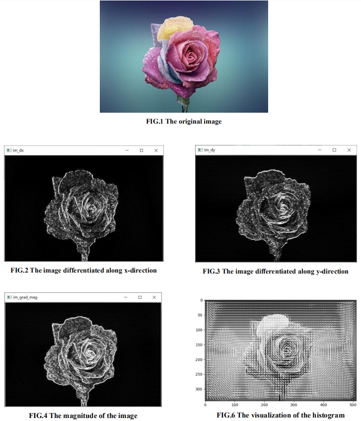
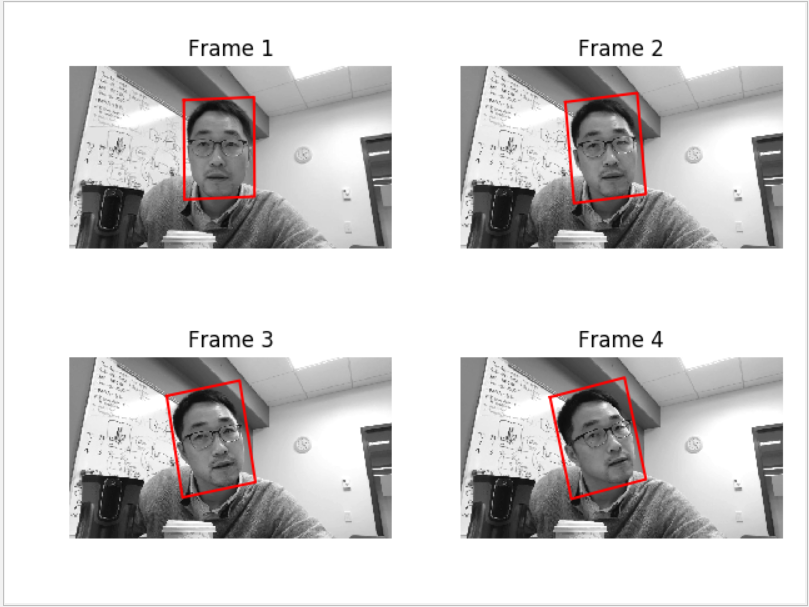
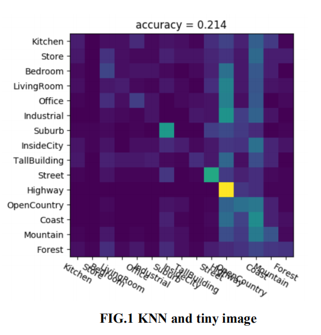
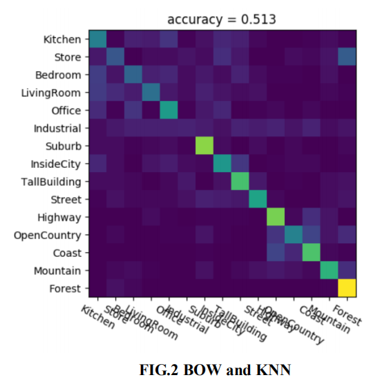
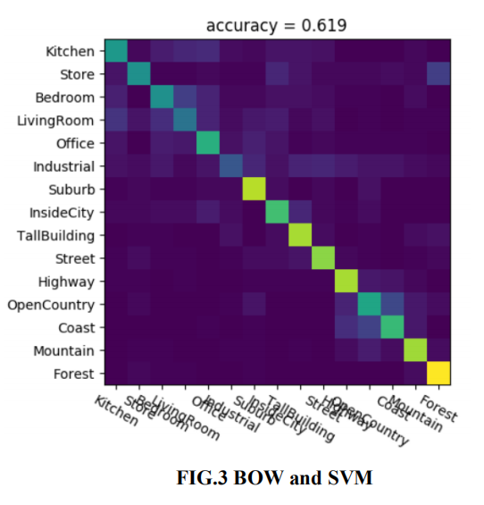

# Computer-Vision-5561
Repo for CSCI 5561, Computer Vision. Coding parts are introduced hereafter. Visual results will be attached if there's any.

## Quick start

    pip install -r requirements.txt
    
## HW1: Histogram of Oriented Gradients (HOG)
[**Assignment**](HW1/hw1.pdf)
+ **Image filtering**
+ **Gradient Computation**
+ **Orientation Binning**
+ **Block Normalization**

[**Report**](HW1/Summary.pdf)

## HW2: Registration
[**Assignment**](HW2/hw2.pdf)
+ **Sift Feature Extraction**
+ **SIFT Feature Matching**
+ **Feature-based Image Alignment**
+ **Image Warping**
+ **Inverse Compositional Image Alignment**
+ **Putting Things Together: Multiframe Tracking**

Note that the testing images are provided by Prof.Hyun soo park.

[**Report**](HW2/Summary.pdf)

## HW3: Scene Recognition
[**Assignment**](HW3/hw3.pdf)
+ **Tiny Image KNN Classification**
 
+ **Bag-of-word Visual Vocabulary**
 
+ **BoW + SVM**
 

[**Report**](HW3/Summary.pdf)

## HW4
+ **Blind boosting for regression and classification** (very interesting)
+ **Adaboost**
+ **Random forest**

[**Report**](https://github.com/kbxpy12321/Machine-Learning-5525/blob/master/HW4/report.pdf)

## HW5
+ **GAN**
 

+ **Denoising AE**
 

+ **VAE**
 

+ **Adversarial examples**
 

[**Report**](https://github.com/kbxpy12321/Machine-Learning-5525/blob/master/HW5/report.pdf)
